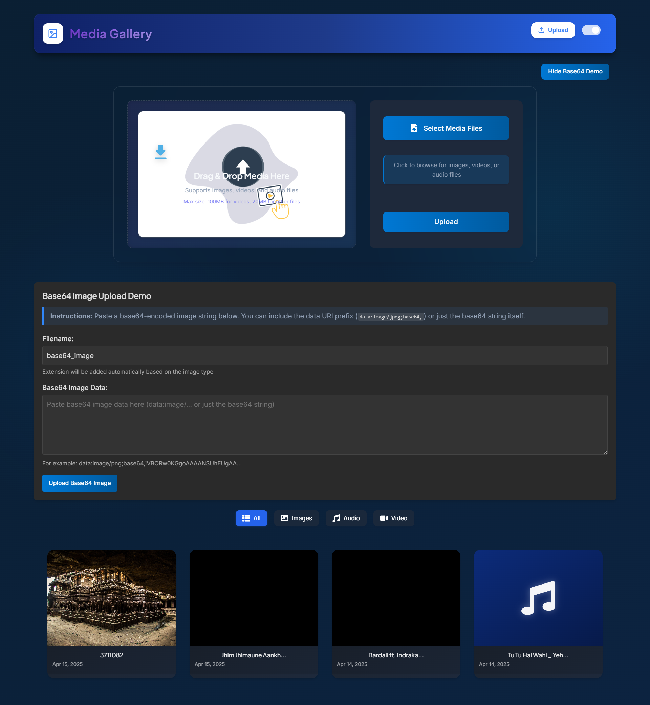

# Cloud-Native Media Gallery (COM682 Coursework 2 Part 2)


A modern, cloud-native media sharing platform built with React and Azure services. This application allows users to upload, view, and manage various media types including images, videos, and audio files. Developed as part of the COM682 Cloud Native Development module assessment.

## Features

- **Multi-media Support**: Upload and view images, videos, and audio files
- **Cloud Storage**: Leverages Azure Blob Storage for scalable, reliable cloud storage
- **Modern UI**: Clean, responsive design with dark/light mode support
- **Drag & Drop**: Easy file uploading with drag and drop functionality
- **Enhanced Media Preview**: Modern, stylish preview with navigation and controls
- **Media Information Panel**: View detailed information about media files
- **Base64 Support**: Convert and display base64-encoded images
- **Error Handling**: Robust error handling with fallback images and toast notifications
- **Responsive Design**: Works seamlessly on desktop and mobile devices
- **Interactive UI**: Engaging user interface with modern design elements

## Technology Stack

- **Frontend**: React.js with modern hooks and functional components
- **Styling**: CSS with custom properties for theming
- **Cloud Services**:
  - Azure Blob Storage for media storage
  - Azure Cosmos DB for metadata storage
  - Azure Logic Apps for REST API implementation
- **Build Tool**: Vite for fast development and optimized production builds

## Screenshots

### Media Gallery View


### Media Preview


### Base64 Image Upload



## Azure Blob Storage Integration

This application demonstrates how to integrate Azure Blob Storage into a React application. Azure Blob Storage is a cloud-based object storage solution that enables developers to store and manage unstructured data such as:

- Images and photos
- Video and audio files
- Documents and logs
- Backups and archives

The application uses the `@azure/storage-blob` SDK to interact with Azure Blob Storage, providing a seamless experience for uploading, viewing, and deleting media files.

## Prerequisites

1. **Azure Account**: You'll need an Azure subscription. Students can get free credits through [Azure for Students](https://azure.microsoft.com/en-us/free/students/)
2. **Azure Resources**:
   - Azure Storage Account for media storage
   - Azure Cosmos DB for metadata storage
3. **Node.js**: Version 14.x or higher
4. **npm**: For package management

## Setup and Installation

1. **Clone the repository**

   ```bash
   git clone https://github.com/ggogogohub/Media-Gallery.git
   ```

2. **Install dependencies**

   ```bash
   npm install
   ```

3. **Configure Azure Services**

   - Create a `.env` file in the root directory (use `.env.example` as a template)
   - Add your Azure Storage account name, SAS token, and Cosmos DB credentials

   ```
   VITE_AZURE_STORAGE_ACCOUNT=blobimagesgallery
   VITE_AZURE_STORAGE_SAS_TOKEN=yoursastoken
   VITE_COSMOS_DB_ENDPOINT=https://cosmossonu.documents.azure.com:443/
   VITE_COSMOS_DB_KEY=yourcosmosdbkey
   VITE_COSMOS_DB_DATABASE=MediaShareDB
   ```

4. **Start the development server**

   ```bash
   npm run dev
   ```

5. **Open the application**
   - Navigate to `http://localhost:5173/` in your browser

## Project Structure

```
cloud-native/
├── public/              # Static assets
├── src/
│   ├── assets/          # Images and other assets
│   ├── components/      # React components
│   │   ├── Base64Demo.jsx          # Component for base64 image upload demo
│   │   ├── DeleteConfirmation.jsx  # Confirmation dialog for file deletion
│   │   ├── EnhancedMediaPreview.jsx # Modern media preview component
│   │   ├── ErrorBoundary.jsx       # Error boundary for catching runtime errors
│   │   ├── Loading.jsx             # Loading indicator component
│   │   ├── MediaCard.jsx           # Legacy media item card component
│   │   ├── MediaGallery.jsx        # Main gallery component for displaying media
│   │   ├── MediaPreview.jsx        # Legacy media preview component
│   │   ├── ModernHeader.jsx        # Modern application header with theme toggle
│   │   ├── NewMediaCard.jsx        # Modern media item card component
│   │   ├── ToastManager.jsx        # Toast notification system
│   │   ├── Toast.jsx               # Individual toast notification component
│   │   ├── UploadForm.jsx          # Form for uploading media files
│   │   └── VideoPlayer.jsx         # Video player component with custom controls
│   ├── config/          # Configuration files
│   │   └── azure.js     # Azure Blob Storage configuration
│   ├── hooks/           # Custom React hooks
│   │   ├── useAzureStorage.js  # Hook for Azure Blob Storage operations
│   │   ├── useFileHandler.js   # Hook for file handling and validation
│   │   ├── useThemeMode.js     # Hook for managing dark/light theme
│   │   └── useToast.js         # Hook for toast notifications
│   ├── styles/          # CSS files for components
│   │   ├── base64Demo.css           # Styles for base64 demo component
│   │   ├── deleteConfirmation.css   # Styles for delete confirmation dialog
│   │   ├── enhancedMediaPreview.css # Styles for enhanced media preview
│   │   ├── errorBoundary.css        # Styles for error boundary component
│   │   ├── mediaPreview.css         # Styles for legacy media preview
│   │   ├── unifiedMediaControls.css # Styles for unified media controls
│   │   └── toast.css                # Styles for toast notifications
│   ├── utils/           # Utility functions
│   │   └── fileUtils.js  # File handling utilities
│   ├── App.jsx          # Main application component
│   ├── App.css          # Main application styles
│   ├── index.css        # Global styles and CSS variables
│   └── main.jsx         # Application entry point
├── .env.example         # Example environment variables
├── package.json         # Project dependencies and scripts
└── vite.config.js       # Vite configuration
```

## Azure Resources Setup

### Blob Storage

1. **Create an Azure Storage Account**

   - Go to the [Azure Portal](https://portal.azure.com/)
   - Create a new Storage Account named `blobimagesgallery`
   - Choose the appropriate subscription, resource group, and region

2. **Create Containers**

   - In your Storage Account, navigate to "Containers"
   - Create three containers: `myimages`, `myvideos`, and `myaudio`
   - Set the public access level to "Blob" for each container

3. **Configure CORS Settings**

   - In your Storage Account, navigate to "Resource sharing (CORS)" under Settings
   - Add a new CORS rule for Blob service with the following settings:
     - Allowed origins: `*` (or your application domain)
     - Allowed methods: Select all methods
     - Allowed headers: `*`
     - Exposed headers: `*`
     - Max age: `86400`
   - This will allow your application to access the Azure Blob Storage from your local development environment

4. **Generate a SAS Token**

   - In your Storage Account, navigate to "Shared access signature"
   - Configure the SAS with the following permissions: Read, Write, Delete, List, Create
   - Set an appropriate expiry time
   - Generate the SAS token and copy it (without the leading '?')

### Cosmos DB

1. **Create a Cosmos DB Account**

   - Go to the [Azure Portal](https://portal.azure.com/)
   - Create a new Cosmos DB account named `cosmossonu`
   - Choose the Core (SQL) API
   - Select the appropriate region

2. **Create a Database**

   - In your Cosmos DB account, navigate to "Data Explorer"
   - Create a new database named `MediaShareDB`

3. **Create Containers**

   - In your database, create three containers:
     - `imagesContainer` (partition key: `/id`)
     - `videoContainer` (partition key: `/id`)
     - `audioContainer` (partition key: `/id`)

4. **Configure the Application**
   - Add the Cosmos DB endpoint and key to your `.env` file

## Contributing

Contributions are welcome! Please feel free to submit a Pull Request.

## License

This project is licensed under the MIT License - see the LICENSE file for details.

## Features in Detail

### Media Gallery

- Modern grid layout of media cards
- Filter by media type
- Responsive design for all screen sizes
- Dark/light mode support that affects all UI components
- Error handling with fallback images

### Media Preview

- Full-screen preview for all media types
- Navigation between media files with counter indicator
- Media controls for audio and video with progress bar
- Information panel with detailed file metadata
- Modern, stylish icons and controls

### Base64 Image Support

- Convert and display base64-encoded images
- Preview before upload
- Support for various image formats
- Automatic detection of image type

### Error Handling

- Robust error handling with toast notifications
- Fallback images for failed media loading
- Graceful degradation for unsupported file types

## Optimizations and Best Practices

This project has been optimized for the COM682 Cloud Native Development assessment with the following improvements:

1. **Code Optimization**:

   - Enhanced component structure with clear separation of concerns
   - Improved error handling with fallback images and toast notifications
   - Added support for base64-encoded images
   - Implemented content type detection for better media type handling

2. **UI/UX Improvements**:

   - Enhanced media preview with modern, stylish controls
   - Added media information panel for detailed file metadata
   - Improved audio visualization with animated wave bars
   - Optimized responsive design for all screen sizes
   - Enhanced dark/light mode support that affects all UI components

3. **Documentation**:
   - Comprehensive README with detailed setup instructions
   - Clear project structure documentation
   - Improved component documentation with PropTypes validation

## Acknowledgments

- This project was created as part of the COM682 Cloud Native Development module assessment
- Thanks to the Azure team for providing excellent documentation and SDKs
